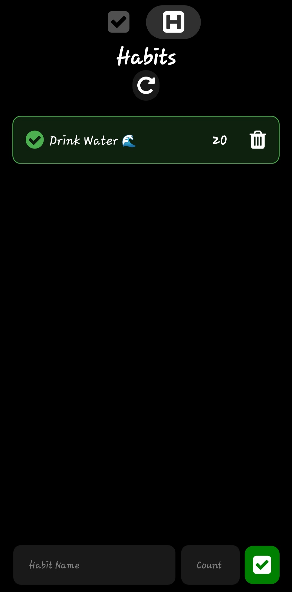

# TasBit

## Task Manager and Habit Tracker App


<div style="display: flex; ">
    
    

</div>

## Preview

1. [Download Expo Go](https://play.google.com/store/apps/details?id=host.exp.exponent)

2. Scan This QR Code


## Features

- Create tasks and finish them
- Add new habits with a name and count
- Track your progress by decrementing the count for each completed habit
- Reset all habit counts at midnight to start fresh each day
- Delete habits you no longer need
- Sound feedback when completing a habit
- Data persistence using AsyncStorage

## Getting Started

To install and run the Habit Tracker App locally on your machine, follow these steps:

1. Clone the repository:

```bash
git clone https://github.com/dinkarhere/habit-tracker-app.git
```

2. Navigate to the project directory:

```bash
cd habit-tracker-app
```

3. Install the dependencies:

```bash
npm install
```

4. Download [Expo Go](https://play.google.com/store/apps/details?id=host.exp.exponent)


5. Start the development server:

```bash
npm start --android
```

6. Scan QR Code: Your app will shown UP


## Contributing

Contributions to the Habit Tracker App are welcome and encouraged! If you find any issues or have suggestions for
improvements, please open an issue or submit a pull request.

1. Fork the repository.
2. Create a new branch: `git checkout -b my-feature-branch`.
3. Make your changes and commit them: `git commit -m 'Add some feature'`.
4. Push to the branch: `git push origin my-feature-branch`.
5. Open a pull request on the original repository.

## Contact
- [dinkarsable01@gmail.com](mailto:dinkarsable01@gmail.com)
- [LinkedIn](https://www.linkedin.com/in/dinkar-sable-40b31021a/)